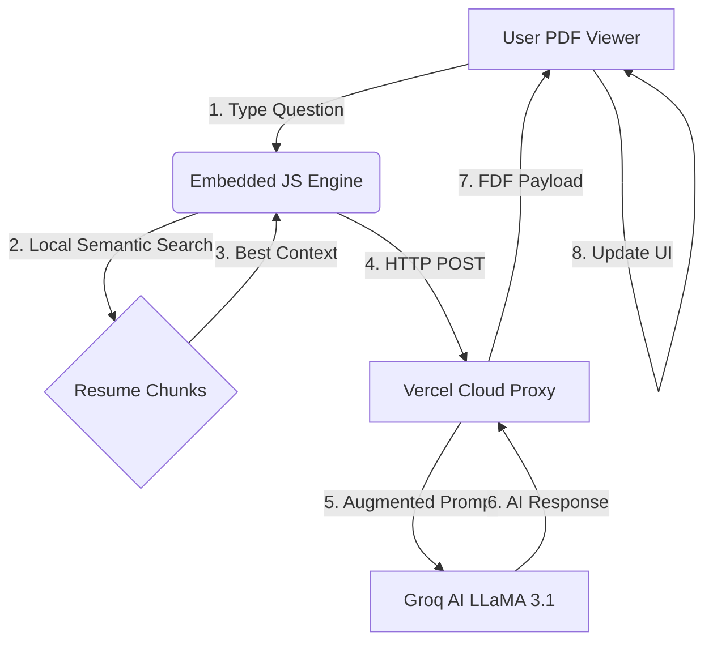

# 🧠 BrainPDF: The World's First RAG-Native Resume
> **Giving your resume a brain using Semantic Search & LLMs — right inside the PDF.**

[](https://vercel.com)
[](https://python.org)
[](https://opensource.org/licenses/MIT)

Traditional resumes are static. **BrainPDF** makes them interactive. This project embeds a full Retrieval-Augmented Generation (RAG) pipeline inside a standard PDF, allowing recruiters to chat with your experience using a high-performance TF-IDF search engine and LLaMA 3.1.

> [!CAUTION]
> ### 🛑 CRITICAL: DO NOT USE BROWSER PDF VIEWERS
> Due to strict security/CORS restrictions in **Chrome, Edge, and Safari**, the "Send" button logic will ONLY work correctly in **Adobe Acrobat Desktop**. Browser-based viewers block the cross-origin network requests required to talk to the AI proxy.

---

## 🕹️ Live Demo Architecture



---

## � Features that feel like Magic

### 🕵️ Local Semantic Search (No Latency)
Equipped with a **Pure JavaScript TF-IDF Engine**. When a user types a query, the PDF performs a local vector-space similarity search across your resume chunks in milliseconds. No cloud required for retrieval.

### 🧩 Intelligent Semantic Chunking
Unlike standard RAG that cuts text blindly, BrainPDF respects the **logical sections** of your resume (Experience, Projects, Education) to ensure the AI always receives coherent, high-value context.

### 🎭 Premium Dark-Mode UI
A bespoke, dark-themed interface appended to your original resume. Clean typography, real-time status updates, and a dedicated "Retrieved Chunks" debugger view.

### ☁️ Cloud-Powered Intelligence
Synchronized with **Groq AI** for lightning-fast inference. The backend is 100% serverless and ready for Vercel deployment.

---

## 🛠️ Global Setup in 60 Seconds

### 1️⃣ Prepare the Engine (Local)
```bash
# Install the core
pip install flask flask-cors fitz pypdf python-dotenv
```
- Rename `.env.example` to `.env`.
- Paste your `GROQ_API_KEY` inside.
- Run the heartbeat: `python proxy_server.py`.

### 2️⃣ Forge the PDF
```bash
python create_rag_pdf.py
```
This generates `Interactive_Resume_Chat.pdf`. Run this script every time you update your `PROXY_URL` or resume content.

---

## 🚀 Deployment (Going Global)

The backend is a lightweight **Python (Flask)** proxy designed to securely handle your API keys and bridge the gap between the PDF's JavaScript and the LLM.

### Vercel Serverless Hosting
1. **Install Vercel CLI**: `npm i -g vercel` (This is just a tool to upload your Python code).
2. **Deploy**: Run `vercel` from this folder.
3. **Environment Secrets**: In the Vercel Dashboard, go to **Settings > Environment Variables** and add:
   - Key: `GROQ_API_KEY`
   - Value: `your_key_here`
4. **Final Sync**: Once your app is live, update the `PROXY_URL` in `create_rag_pdf.py` as detailed below.

### 🌟 The "Live" Handshake
Once hosted, update the `PROXY_URL` in `create_rag_pdf.py` with your Vercel link:
```python
PROXY_URL = "https://your-live-app.vercel.app/generate-rag-fdf"
```
Regenerated the PDF, and it now works for anyone, anywhere, forever.

---

## 🛡️ Security
This project uses `.env` patterns and GitHub push protection measures to ensure your API keys stay private. **Never upload your `.env` file.**

## 📄 License
MIT © 2026 Naresh Kumar Lahajal
